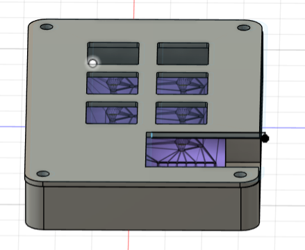
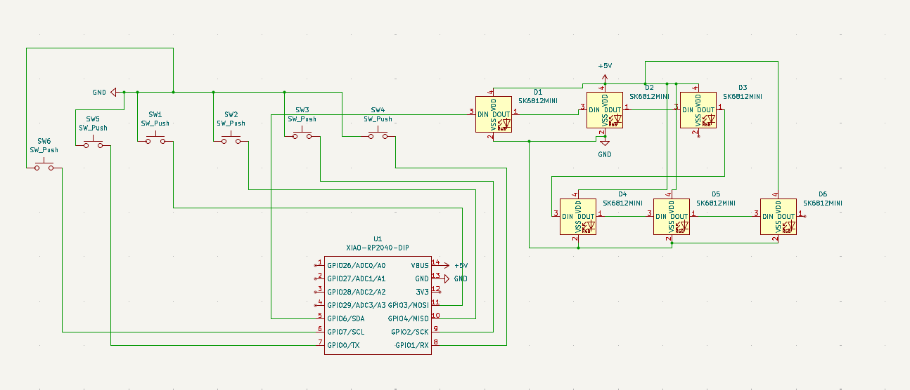
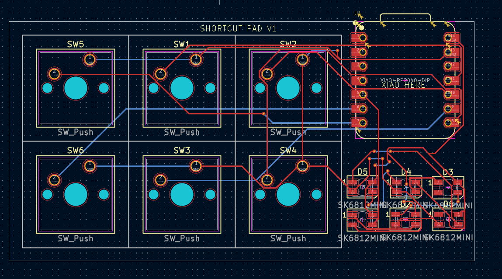

Shortcut pad is a 6 key layered macropad. You can switch between layers using the last key. the layers contain different macros.

  
Schematic:  
  
PCB:  
  

BOM:  
XIAO RP2040 (1)  
SK6812 MINI-E LEDs (6)  
MX-Style switches (6)  
M3x16mm screws (4)  
3d printed case (top and bottom)  

demo: https://www.reddit.com/user/Huge_Cartoonist5504/comments/1m5prar/shortcut_macropad/
